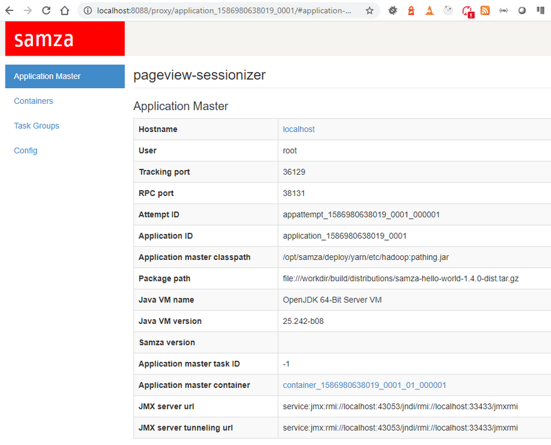

# Web Session

## About

A demo on how to calculate [Web Session](https://gerardnico.com/marketing/analytics/session) on Yarn


## Prerequisites

[A running grid in a docker container](samza-grid-docker.md)

## Steps

  * Deploy the app. A deployment will create a distribution file with all [shell script](https://github.com/apache/samza/tree/master/samza-shell/src/main/bash) needed to run them against Yarn.

```dos
gradlew clean deploy 
```
  * The [deploy directory](../deploy) directory should now contain the application packaged
  
  * Connect to the container with [docker-samza-bash.bat](../docker-samza-bash.bat)

```bash
# from dos
docker-samza-bash.bat
# fro Git Bash
docker-samza-bash.sh
```

  * Create the source topic

```bash
kafka-topics.sh --zookeeper localhost:2181 --create --topic pageview-session-input --partitions 2 --replication-factor 1
```

  * Start the Yarn job

```bash
./deploy/samza/bin/run-app.sh --config-factory=org.apache.samza.config.factories.PropertiesConfigFactory --config-path=file://$PWD/deploy/samza/config/yarn-session-window-example.properties
```
```text
2020-04-15 15:06:49.277 [main] ClientHelper [INFO] submitting application request for application_1586961594832_0001
2020-04-15 15:06:49.852 [main] YarnClientImpl [INFO] Submitted application application_1586961594832_0001
2020-04-15 15:06:49.855 [main] JobRunner [INFO] Job submitted. Check status to determine when it is running.
```

  * Check that the app is in `RUNNING` state at [http://localhost:8088/cluster/apps](http://localhost:8088/cluster/apps)
  * Click on the Application Master link. You should get a similar web page.
  

 
 
  * Produce some messages to the "pageview-session-input" topic 
```bash
kafka-console-producer.sh --topic pageview-session-input --broker-list localhost:9092 < ./data/pageview-session-input.jsonl
```

  * Consume messages from the "pageview-session-output" topic 
```bash
kafka-console-consumer.sh --bootstrap-server localhost:9092 --topic pageview-session-output --property print.key=true --from-beginning
```